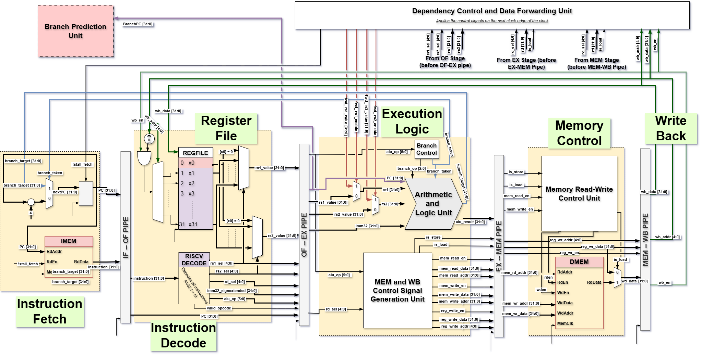

# InOrderSingleIssue Core Pipeline

This repository contains the implementation of an in-order, single-issue processor core pipeline written in SystemVerilog. The design is modular and aims to provide a clear and educational example of a simple CPU pipeline.

## Directory Structure

```
InOrderSingleIssue/
└── core_pipeline/
    ├── fetch.sv
    ├── decode.sv
    ├── execute.sv
    ├── memory.sv
    ├── writeback.sv
    └── proc_top.sv
└── packages/
    └── rv32_pkg.sv
└── testbench/
    └── proc_top_tb.sv
```

## Pipeline Stages

The core pipeline is divided into five classic stages:



1. **Fetch (`fetch.sv`)**
   - Fetches instructions from instruction memory.
   - Maintains the program counter (PC).
   - Handles PC increment and branch/jump redirection.

2. **Decode (`decode.sv`)**
   - Decodes the fetched instruction.
   - Reads source registers from the register file.
   - Generates control signals for subsequent stages.

3. **Execute (`execute.sv`)**
   - Performs ALU operations (arithmetic, logic, shifts, etc.).
   - Calculates branch targets and evaluates branch conditions.

4. **Memory (`memory.sv`)**
   - Handles data memory access for load and store instructions.
   - Passes ALU results or loaded data to the next stage.

5. **Writeback (`writeback.sv`)**
   - Writes results back to the register file.
   - Ensures correct data is written for both ALU and memory operations.

## Top-Level Integration

- The `proc_top.sv` module instantiates and connects all pipeline stages.
- Handles pipeline registers and control logic for stalling and forwarding (if implemented).
- Interfaces with instruction and data memory modules.

## Features

- **Single-Issue, In-Order Execution:** Only one instruction is issued per cycle, and instructions are retired in program order.
- **Simple Hazard Handling:** Basic stalling for data hazards; no out-of-order execution.
- **Parameterizable:** Key parameters (e.g., data width, register count) can be configured.
- **Well-Documented:** Each module contains detailed comments explaining its functionality and interface.

## Open Items / In Progress
- **Real Hardware for Arithmetic**
    - Realistic Adders & Multipliers with options both for single-cycle and multi-cycle arithmetic
    - Pipelined Dividers and Rem calculation units
- **Stack Operations**
    - Stack operations required for conditional/unconditional jump instructions
- **Memory Latency Modeling and Handling**
    - Modeling realistic design of the memory interfaces for both Instruction and Data Memories
    - Added controls for dependency and forwarding based on memory latency handling
- **Instruction Prefetching**
    - Instruction prefetching to improve fetch throughput independent of memory latencies
- **Branch Prediction**
    - Branch Predictors to reduce branch penalties
- **Advanced Testbench**
    - Self-testing testbench with modular, scalable infrastructure for future improvements
    - Design-independent program order scoreboard for unbiased verification

**Other major architecture updates will follow in different directories.**

## Getting Started

1. **Prerequisites:** Requires a SystemVerilog simulator (e.g., ModelSim, VCS, Verilator).
2. **Simulation:** Use the provided testbenches or write your own to simulate the pipeline.
3. **Customization:** Modify parameters or extend the pipeline as needed for your application.

## File Descriptions

| File         | Description                                         |
|--------------|-----------------------------------------------------|
| fetch.sv     | Instruction fetch stage logic                       |
| decode.sv    | Instruction decode and register read                |
| execute.sv   | ALU operations and branch evaluation                |
| memory.sv    | Data memory access                                  |
| writeback.sv | Register file writeback                             |
| proc_top.sv  | Top-level pipeline integration                      |

## License

This project is open source and available under the MIT License.

## Acknowledgments

The design and comments are inspired by educational CPU pipeline examples and are intended for learning and research purposes.
# proc_design
Processor Design for hobby and learning
